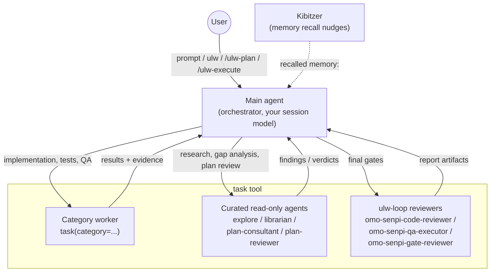
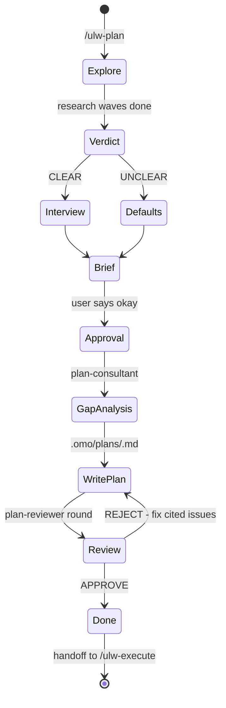

<!-- sources: packages/senpi-task/src/tools/task/description.ts, packages/senpi-task/src/agents/builtin/index.ts, packages/senpi-task/src/category/builtins.ts, packages/omo-senpi/skills/ulw-plan/SKILL.md, packages/shared-skills/skills/ulw-execute/SKILL.md, packages/omo-senpi/skills/mass-ulw/SKILL.md, packages/omo-senpi/skills/ulw-loop/SKILL.md, packages/omo-senpi/skills/hyperplan/SKILL.md, packages/omo-senpi/skills/ultrawork/SKILL.md, packages/omo-senpi/src/components/ulw-execute-continuation/index.ts, packages/omo-senpi/src/components/ulw-execute-continuation/boulder-eligibility.ts, packages/omo-senpi/src/components/memory/AGENTS.md, packages/omo-config-core/src/schema/agent.ts -->

# Orchestration System Guide

omo-senpi turns one coding session into a coordinated team by separating planning from execution. The main agent (the session you're typing into) does the thinking and the orchestration; everything else is delegated through the `task` tool.

---

## TL;DR - When to Use What

| Situation | Approach | What happens |
| --- | --- | --- |
| Quick fix, single file | Just prompt | The main agent does it directly. |
| Complex, and explaining the context is tedious | Type `ulw` (or `ultrawork`) | The main agent enters ultrawork mode: explores, plans in a notepad, delegates, verifies with evidence. |
| Complex, and you want a written, reviewed plan first | `/ulw-plan`, then `/ulw-execute` | The Ultrawork Planner interviews you and writes `.omo/plans/<slug>.md`. `/ulw-execute` then runs that plan in the same session. |
| Many tasks where some must wait on others | `mass-ulw` | The main agent defines a dependency graph and drives it through the `workflow` tool, one run per phase. |
| Several lanes that touch the same module and need to talk mid-flight | Team mode (`team_create`) | The main agent leads background member children. See [Team Mode](./team-mode.md). |

**Decision flow:**

```
Is it a quick fix or a simple task?
  |- YES -> just prompt
  |- NO  -> is explaining the full context tedious?
             |- YES -> type "ulw" and let the agent figure it out
             |- NO  -> do you need a written, reviewable plan?
                        |- YES -> /ulw-plan, approve, then /ulw-execute
                        |- NO  -> real ordering between many tasks? mass-ulw
                                  overlapping lanes? team mode
                                  otherwise "ulw"
```

---

## The Architecture

There is one orchestrator: the main agent, running on your session model. It never hands the session to a different agent. Instead it delegates units of work through `task`, reads results back, and keeps the plan, the todo list, and the evidence in sync.



### The main agent

The main agent is whatever model your session is using. It carries the ultrawork directive, the planning skill, and the execution skill; there's no separate "planner agent" or "executor agent" to switch to. Tuned prompt presets exist for the common frontier models, and the planning and execution prompts are written to work across families. See [Agent-Model Matching](./agent-model-matching.md) for the model-specific notes.

### Delegation through `task`

Every spawn provides exactly one of `category` or `subagent_type`:

- `task(category="...")` routes to **the category worker**: a fresh worker session configured by the category's model and skills. This is how implementation, tests, and QA get done. A category-routed task always takes its model from `omo.json` (`categories.<name>.models`); passing `model` alongside `category` is rejected.
- `task(subagent_type="...")` invokes a named agent directly. The builtin roster is:
  - Curated read-only agents (in-process, cannot write files): `explore` (codebase grep: "where is X?"), `librarian` (remote repos, official docs, OSS examples), `plan-consultant` (pre-planning gap analysis), `plan-reviewer` (plan review). `plan-consultant` and `plan-reviewer` are **plan-gated**: spawnable only after you explicitly asked for the ulw-plan workflow, a `.omo/plans/*.md` file was touched this session, and `/ulw-execute` hasn't run.
  - ulw-loop reviewers (they write report artifacts, so they aren't in the read-only set): `omo-senpi-code-reviewer` (diff, tests, risk), `omo-senpi-qa-executor` (runs real scenarios, records surface evidence), `omo-senpi-gate-reviewer` (approves unless it can cite a failed success criterion).

Useful spawn options: `run_in_background: true` for parallel waves (the default posture), `load_skills` to prepend skills to the child's prompt, `name` for a stable handle, `task_summary` for the one-line footer label. Continue a child with `task_send`, peek with `task_output`, end it with `task_cancel`; `/tasks` lists what this session spawned. `plan-reviewer` is one-shot: `task_send` to it is always refused.

Curated agents are rejected as team members. Route them through `task`, never `team_create`.

### Kibitzer memory nudges

Kibitzer is the memory component's read-only recall judge: one resident sidecar session per main agent session, started lazily and kept for the life of that session. Every prompt, tool call and tool result of the main session is fed to it as a bounded, redacted event (tool arguments, result heads, assistant text and prompts are all capped; secrets are masked before anything is stored). It only spends a model turn when a prompt or tool call surfaces a stored memory it has not judged yet, and at most two such wakes run at once per machine. Inside a wake it can `read` and `grep` the workspace, page the parent transcript with `session_entries`, and `search`/`read` memory - eight tool calls per wake, read-only, nothing that writes memory or files - and its only output is `nudge`, which becomes a notice reading `recalled memory: <hint>` on the main agent's side. When its own context fills up it reseeds itself with what it has already delivered or rejected; when its model fails it backs off and comes back later. It never edits anything and never wakes an idle session; it just reminds the main agent of what it already knows. `/search` is the manual recall surface, and `memory.recall.enabled: false` turns Kibitzer off.

---

## Planning: the Ultrawork Planner

`/ulw-plan` puts the main agent into planning mode as **the Ultrawork Planner**, a planning consultant. It announces `ULW-PLAN MODE ENABLED!`, states that it won't implement anything until you say okay, and explains that approval authorizes writing the plan only. Execution starts separately with `/ulw-execute`.

Plan mode is sticky. "do X", "fix X", "just do it" all mean "plan X".

### The interview

The planner explores first: parallel read-only research through `explore` and `librarian`, plus the `architect` and `ultrabrain` categories as advisory design lanes when they're available. Only then does it decide how to talk to you:

- **CLEAR intent** (you know the outcome; only preferences remain): it asks the surviving owner-decisions, with the reason for each, and nothing the repo could have answered.
- **UNCLEAR intent** (the outcome itself is fuzzy): it adopts and announces best-practice defaults instead of interviewing you, and turns high-accuracy review on automatically.
- **On the fence**: treated as CLEAR with exactly one question.

If you say "ask me" or "interview me", it interviews regardless. Owner-decisions (anything irreversible, destructive, or a spend) always survive as a question, even when a default exists.



### Plan Consultant gap analysis

Before the plan is written, the planner spawns `plan-consultant` to catch what it missed: hidden intentions in the request, ambiguities that would derail a worker, over-engineering and scope creep, missing acceptance criteria, unaddressed edge cases. The planner has the whole picture in its head; the consultant forces that implicit knowledge onto the page.

### Plan Reviewer high-accuracy rounds

High-accuracy review is the default for every plan `/ulw-plan` produces; the only opt-out is you declining it. One round is exactly one `plan-reviewer` pass over the complete plan file. The reviewer is approval-biased and rejects only verified blockers:

- Referenced files exist and support the plan's claims
- Every task gives a developer a usable starting point
- Tasks don't contradict each other
- QA scenarios name the tool, the steps, and the expected result
- No missing information would stop execution cold

An approval whose remaining items are notes counts as approval. On a rejection the planner fixes every cited issue and resubmits. Rounds are capped at 5 unless you ask for more.

The spawn is contract-driven: the harness replaces the `plan-reviewer` prompt with the canonical review contract (one `.omo/plans/*.md` path), so anything else in the prompt is discarded.

### Plan-gate rules

- `plan-consultant` and `plan-reviewer` open only when you explicitly requested the ulw-plan workflow, a plan artifact under `.omo/plans/` was touched this session, and `/ulw-execute` hasn't been invoked.
- A bare `ulw` run never gets them, however big the work feels. It records a self-review in its notepad instead.
- When `/ulw-execute` finds no plan and bootstraps `/ulw-plan` itself, the gate stays locked: that bootstrap plan is written without gap analysis or review, and the planner says so.

### Plan artifacts

The planner runs `scaffold-plan.mjs` rather than hand-building files. A draft lives at `.omo/drafts/<slug>.md` (the compaction-safe resume point, carrying `intent`, `review_required`, decisions, and the approval gate); after your okay the plan lands at `.omo/plans/<slug>.md`. Every executable item is a column-zero `- [ ] N. <title>` row with references, acceptance criteria, QA scenarios, and a `Recommended task executor category:` line.

### Adversarial alternative: `/hyperplan`

When one planner isn't enough rigor, `/hyperplan` stands up a hostile team that cross-critiques the plan before it's formalized. The result is still a `.omo/plans/*.md` file you hand to `/ulw-execute`.

---

## Execution: `/ulw-execute`

```text
/ulw-execute [plan-name] [--worktree <absolute-path>] [--make-pr] [--ship]
```

- `plan-name` (optional): a full or partial file stem under `.omo/plans/`.
- `--worktree`: reuse an existing task-owned worktree for the first phase instead of creating one.
- `--make-pr`: deliver each phase's worktree as a pull request and hand off with the URL; merge only if you ask.
- `--ship`: implies `--make-pr`; stay on the job until the PR is merged, fixing CI and review feedback from the worktree.

The main agent executes the approved work plan in the same session. It doesn't become a different agent; it picks up the execution skill and the orchestrator rule that comes with it: **it never writes product code itself**. Every implementation, test, QA, and review unit is delegated to a spawned worker. The main agent's hands touch plan selection, `.omo/` state, decomposition, dispatch, verdicts, and evidence.

### What happens when you run it

1. **Select the plan.** Read `.omo/boulder.json`; if this session has one active or paused work, resume it. Otherwise match `plan-name`, auto-select a lone plan, or ask one focused question when several remain. With no selectable plan at all, it bootstraps `/ulw-plan` first.
2. **Register the goal and todos.** One registered goal for the session (via `create_goal` when the tool exists), one todo per column-zero checkbox, all up front.
3. **Write boulder state.** `.omo/boulder.json` is a multi-work registry (`works` + `active_work_id`). Each work records `active_plan`, `plan_name`, `session_ids` (prefixed `senpi:<session_id>`), `status`, and `worktree_path`.
4. **Execute the next checkbox.** Classify it LIGHT or HEAVY, decompose it into worker-sized sub-tasks, and dispatch every independent sub-task in one parallel burst, routed by the plan's `Recommended task executor category:` line or the delegation router below.
5. **Verify and record.** Five gates per checkbox: plan reread, automated verification, a Manual-QA artifact, adversarial QA, cleanup receipts. Evidence goes to `.omo/ulw-execute/ledger.jsonl`. A worker's done claim is verified by an independent reviewer (the gate reviewer or a fresh reviewer worker) before the checkbox flips to `- [x]`.
6. **Finish.** When every top-level checkbox is checked, run the plan's final verification, sync `.omo/` state back, complete the PR lifecycle if requested, and print an `ORCHESTRATION COMPLETE` block.

Each plan wave runs in its own task-owned worktree and lands on the integration base once its checkboxes are verified. Only the orchestrator merges.

### Continuation across sessions

The `ulw-execute-continuation` component watches `.omo/boulder.json`. While the current session's work is `active` or `paused` and the plan still has unchecked top-level boxes, every user prompt gets a steering reminder appended (read the boulder state and the plan, continue with evidence-bound execution, don't start unrelated work), and an idle turn is re-injected automatically, up to 8 consecutive continuations. Nothing is lost when a session dies mid-plan: run `/ulw-execute` again and the same work resumes from the plan checkboxes and the ledger.

```
Monday 9:00 AM
  |- /ulw-plan "Build user authentication"
  |- Ultrawork Planner interviews, writes .omo/plans/user-auth.md, plan-reviewer approves
  |- /ulw-execute
  |- boulder.json created, tasks 1-2 land
  |- [session ends]

Monday 2:00 PM (new session)
  |- /ulw-execute
  |- "Resuming 'user-auth' - 2 of 8 tasks complete"
  |- execution continues from task 3
```

---

## Categories + Skills

### Why categories instead of model names

A model name in a prompt carries the model's own idea of its limits. A category carries intent:

```typescript
task({ category: "ultrabrain", prompt: "..." }); // one genuinely hard, logic-heavy problem
task({ category: "visual-engineering", prompt: "..." }); // frontend, UI/UX, styling
task({ category: "quick", prompt: "..." }); // mechanical, single-file, boilerplate
```

### Builtin categories

`architect`, `artistry`, `deep`, `quick`, `ultrabrain`, `unspecified-high`, `unspecified-low`, `visual-engineering`, `writing`.

The delegation router used by `/ulw-execute`:

| Category | Route here |
| --- | --- |
| `quick` | mechanical, single-file, boilerplate, config/copy; the default for every splittable piece |
| `unspecified-low` | small tasks that fit no other category |
| `unspecified-high` | standard features across a few files with known patterns |
| `visual-engineering` | frontend, UI/UX, styling, animation |
| `writing` | documentation and prose |
| `deep` | hairy debugging, research-heavy or subtle cross-module work |
| `ultrabrain` | one genuinely hard, logic-heavy problem; hand it the goal, not steps |
| `architect` | the architect consult lane: module boundaries, decomposition, trade-offs (advisory, read-only) |

Splittable work splits into a swarm of `quick`/`unspecified-low` workers in one burst. Cohesive hard work stays whole and goes to `deep` or `ultrabrain` as one delegation.

Some categories gate on a model being present in your registry (`ultrabrain` and `deep` need a GPT flagship, for example); an unavailable category is reported as such rather than silently routed to a different family. Projects and users can add categories in `omo.json`.

### Skills

`load_skills` prepends named skills to the worker's prompt:

```typescript
task({ category: "visual-engineering", load_skills: ["frontend"], prompt: "..." });
task({ category: "deep", load_skills: ["playwright"], prompt: "..." });
```

The main agent's own skills (`ulw-plan`, `ulw-execute`, `ulw-loop`, `mass-ulw`, `hyperplan`, `ultrawork`, `ulw-research`) are invoked by name; workers get skills only through `load_skills`.

### Dependency graphs: `mass-ulw`

When tasks have real ordering (C needs A and B first), `mass-ulw` defines a run for the `workflow` tool from an eval cell: nodes with `id`, `prompt`, `category`, and `dependsOn`. One run covers one phase; the next phase is a new run. Failed nodes are recovered with `retry`, steered with `send`, or edited with `amend` without re-running what already finished. `/dag` opens the detail view.

---

## Team Mode

Team mode is for overlapping lanes that need to exchange discoveries mid-flight. The main agent becomes the lead of background member children (`team_create`), sends work with `task_send`, tracks it through `task_create` / `task_list` / `task_update`, and tears down with `team_delete`. Curated read-only agents can't be members. Full details, config schema, and eligibility rules: [Team Mode](./team-mode.md).

---

## Configuration

`omo.json` controls the delegation surfaces. Agent overrides use the agent id as the key; category overrides use the category name.

```jsonc
{
  "agents": {
    "plan-consultant": {
      "models": ["anthropic/claude-opus-5"]
    },
    "plan-reviewer": {
      "models": ["openai/gpt-5.6-sol"],
      "reasoning": "high"
    },
    "explore": {
      "disable": false
    }
  },
  "categories": {
    "quick": {
      "models": ["anthropic/claude-haiku-4-5"]
    },
    "writing": {
      "models": ["anthropic/claude-opus-5"]
    }
  }
}
```

Agent entries accept `model`, `models` (ordered fallback chain), `reasoning`, `tools`, `allowed_subagents`, `disallowed_tools`, `max_turns`, `temperature`, and `disable`. Category entries carry the `models` chain the category worker is built from. The full schema is in the [omo.json reference](../reference/omo-json.md).

---

## Troubleshooting

### "I ran /ulw-plan but it isn't writing a plan"

That's the design. The Ultrawork Planner explores first, tells you whether it read your intent as CLEAR or UNCLEAR, asks only the owner-decisions that survived exploration, and then presents a brief. The plan is written after you say okay. There is no "make it a plan" trigger; approve the brief.

### "/ulw-execute says no plan was found"

- With no plans under `.omo/plans/`, `/ulw-execute` bootstraps `/ulw-plan` and generates one (without gap analysis or review, since the plan gate is locked on that path). Run `/ulw-plan` yourself first if you want the reviewed version.
- With several plans and no active work, pass the stem: `/ulw-execute user-auth`.
- Don't reach for deleting `.omo/boulder.json` first. Works recorded for other sessions are ignored; the session id is part of the match.

### "The planner refuses to spawn plan-reviewer"

Both `plan-consultant` and `plan-reviewer` are plan-gated. The gate opens only after an explicit ulw-plan request, a touched `.omo/plans/*.md` file in this session, and no `/ulw-execute` yet. A bare `ulw` run, however large, self-reviews in its notepad instead. If you want the review, start with `/ulw-plan`.

### "Should I type ulw or write a plan?"

Type `ulw` when the target is narrow enough to state in a sentence and you're happy to let the agent decide the rest. Write a plan with `/ulw-plan` when the work is brownfield, multi-file, or when you want the scope boundaries in writing before anything is touched. A constrained brownfield plan looks like:

```text
Fix <problem> in this existing codebase.
Preserve the current architecture and public behavior.
Use the smallest viable change.
Follow local patterns in <files or areas>.
Do not refactor, rename, reorganize, or clean up unrelated code.
List exact files in scope and exact verification commands.
```

Then `/ulw-execute` runs against the written scope instead of treating the task as an open-ended modernization pass.

---

## Further Reading

- [Overview](./overview.md)
- [Team Mode](./team-mode.md)
- [Agent-Model Matching](./agent-model-matching.md)
- [Features Reference](../reference/features.md)
- [Configuration Reference](../reference/configuration.md)
- [Manifesto](../manifesto.md)
